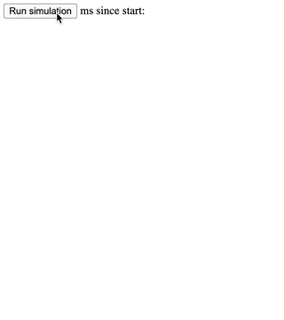
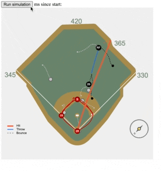
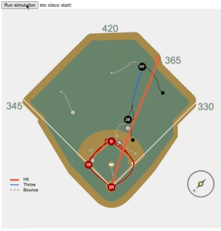
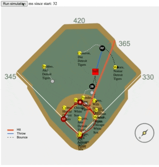

# Thought Process

Notes from journey in understanding the structure of [data.json](src/data.json) in order to create my [White Sox demo](https://github.com/curtgrimes/white-sox-demo), in chronological order:

* `mergedPositionalData` looks the most interesting... I think I want to show some kind of side-by-side with the video and a representation of the data. I assume `mergedPositionalData` gives me something about the players and the ball. I see `x` and `y`. What are `x` and `y` relative to? What is `id` and what do the different `typ` (type?) values mean?
* Oh, cool...there's an SVG at `measurements.diagram`. I'm sure I'll end up using that.
* Playing back the values in real time...I can see that 10, 11 and 12 definitely look like base runners, so these values represent players, but it looks like I have it inverted on the X axis for some reason.

  
* I see that `gameEvent.runners` has three values with `pos` values of 10, 11, and 12, so those are definitely my runners. Are those IDs unique IDs for each of them?
* I see `gameEvent.lineup` has IDs that look the same. If I'm right about them being runners then 10 should be Zack Collins according to what the GitHub gist says about this data. Do a google search for ["mlb 641470"](https://www.google.com/search?q=mlb+641470) and the first result is Zack Collins, so yes, these must be unique IDs for each MLB player 
* I'll probably want to show their names...can I get that programatically somewhere? Yes, looks like [MLB has a free API](https://appac.github.io/mlb-data-api-docs/) I can use to get at least [player and team names](http://lookup-service-prod.mlb.com/json/named.player_info.bam?sport_code=%27mlb%27&player_id=641470), which I think would be nice to show
* I actually had it inverted the Y axis, not X...so I flipped that and it looks right, but now I need to figure out how to align the players to the map. Looks like Collins starts off in the immediate left bottom, so I'm guessing that home base is used as the origin of all of the coordinates.

  
* Looks like it is lined up good enough for now. I'm sure the data exists to be able to line it up much better than I have here, but for the purposes of this demo I think this works.

  
* I've got the ball data mapped but the timing doesn't align with the player position data -- I'll manually offset it so it looks right, but I'm sure the data exists to be able to do this more precisely

  
* [See the final result](https://white-sox-demo.curtgrimes.com)